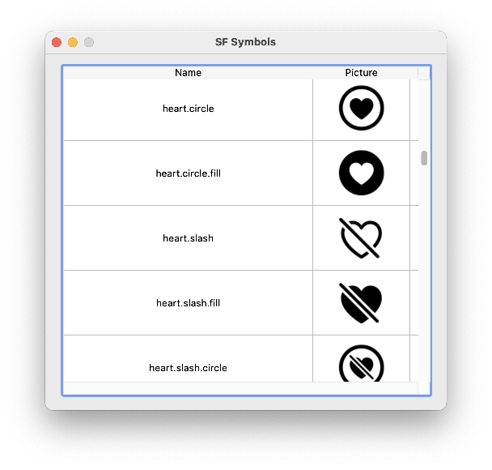

# SFSymbols

⚠️ Only available on macOS Bigsur

Use on macOS [SF Symbols](https://developer.apple.com/sf-symbols/)
 


## How to use

```4d
$picture:=SFSymbolPicture("lasso.sparkles")
```

You could also set size

```4d
$picture:=SFSymbolPicture("lasso.sparkles"; New object("width"; 64; "height"; 64))
```

## Get a list of available icons

Download the recommanded app from [apple site](https://developer.apple.com/sf-symbols/) or you could look at the [demo app resources](https://github.com/mesopelagique/SFSymbols/blob/main/sample.4dbase/Resources/list.txt)

## Install

Compile the projet and put `SFSymbols.bundle` into your [Plugins folder](sample.4dbase/Plugins/) until an offical release is available in github release.
